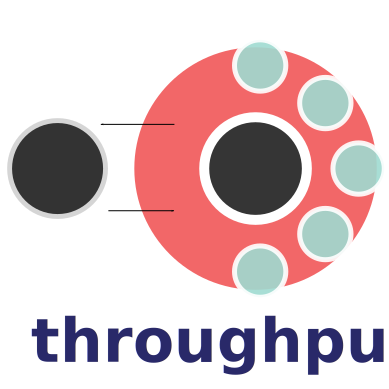

# Throughput

	
	

		
 Throughput is an NSF Funded project that aims to reduce data entropy with the sciences through the implementation of a credentialed, crowd-sourced annotation engine.  The Throughput project is a user-centric system, focused on the long tail scientist, who aims to use best practices, who has specialized domain knowledge and, often deep knowledge about specific datasets, publications or data resources.  Throughput offers a mechanism for them to share this information with other researchers in a targeted and concise manner.

	

## Project Components

### Data Heterogeneity, Data Fragmentation, and Standards Adoption in the Geosciences: Common Challenges and Opportunities

Data heterogeneity and fragmentation are pervasive and universal challenges. The Throughput Data Project is an effort to manage heterogeneity by providing end users with tools and resources to help manage issues of heterogeneity in interdisciplinary research projects.  Providing guidance on standards, a cookbook of data transformations and links to resources across the geosciences in an effort to reduce "time to science".

### The Throughput Annotation Engine

The loss of information about individual datasets, data entropy, is a critical problem in the geosciences.  The Throughput Annotation Engine leverages unique and persistent identifiers, such as DOIs and [ORCID](http://orcid.org)s to link data resources to expert annotations in a credentialed crowd-sourcing effort.

## Participants and Support

Throughput involves a number of participants from universities across the United States and internationally.  Support is provided through the NSF [EarthCube Program](http://earthcube.org).

## Activities

See more about throughput-related activities on the [Throughput Activities webpage]().